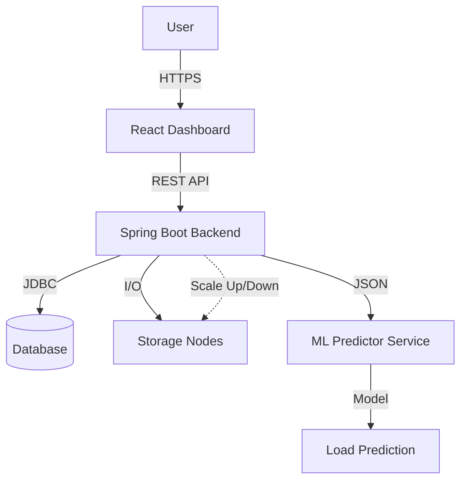

# CloudFileSystem


**CloudFileSystem** is a robust, resilient distributed file storage simulation platform designed to demonstrate advanced distributed systems concepts. It integrates a secure Java Spring Boot backend, a modern React frontend, and a Python-based Machine Learning service for predictive scaling.

---

## Key Features

- **Distributed Architecture**: Simulates file storage across multiple nodes with automated replication and fault tolerance.
- **Predictive Auto-Scaling**: Utilizes a Random Forest ML model to predict system load 30 minutes in advance and proactively provision resources.
- **Modern Dashboard**: A responsive, industry-standard React/TypeScript UI for managing files, users, and viewing real-time system metrics.
- **Enterprise Security**: Role-Based Access Control (RBAC) with JWT authentication and secure file permissions.
- **DevOps Ready**: Fully containerized with Docker, orchestrated with Docker Compose, and CI/CD ready with Jenkins pipelines.

---

## Architecture

The system operates on a microservices-inspired architecture:



---

## Project Structure

| Module                           | Description                                                               |
| :------------------------------- | :------------------------------------------------------------------------ |
| **[`backend`](./backend)**       | Spring Boot application handling core logic, file management, and APIs.   |
| **[`frontend`](./frontend)**     | React + Vite application providing the user interface.                    |
| **[`ml-service`](./ml-service)** | Python Flask service for load prediction and data analysis.               |
| **[`ops`](./ops)**               | Infrastructure as Code (IaC), Docker Compose, and Jenkins configurations. |
| **[`docs`](./docs)**             | Comprehensive documentation and setup guides.                             |

---

## Getting Started

### Prerequisites

- **Java JDK 17+**
- **Node.js 18+**
- **Python 3.9+**
- **Docker** (Optional, for containerization)

### 1. Backend Setup

```bash
cd backend
./mvnw clean install
java -jar target/CloudFileSystem-1.0-SNAPSHOT.jar
```

_The backend runs on `http://localhost:8080`._

### 2. Frontend Setup

```bash
cd frontend
npm install
npm run dev
```

_The dashboard runs on `http://localhost:5173`._

### 3. ML Service Setup

```bash
cd ml-service
python -m venv venv
source venv/bin/activate  # Windows: venv\Scripts\activate
pip install -r requirements.txt

# Generate Data & Train Model (Required on first run)
python generate_data.py
python train_model.py

python app.py
```

_The ML service runs on `http://localhost:5000`._

---

## Documentation

- **[Complete Setup Guide](./docs/COMPLETE_SETUP_GUIDE.md)**: Detailed step-by-step installation instructions.
- **[ML System Setup](./docs/ML_SETUP.md)**: Deep dive into the predictive scaling engine.
- **[Future Enhancements](./docs/FUTURE_ENHANCEMENTS.md)**: Roadmap for the project.

---

## Contribution

We welcome contributions! Please see our [Contributing Guidelines](CONTRIBUTING.md) for details.

1.  Fork the repository
2.  Create your feature branch (`git checkout -b feature/amazing-feature`)
3.  Commit your changes (`git commit -m 'Add some amazing feature'`)
4.  Push to the branch (`git push origin feature/amazing-feature`)
5.  Open a Pull Request

---

## License

This project is licensed under the MIT License - see the [LICENSE](LICENSE) file for details.

---
